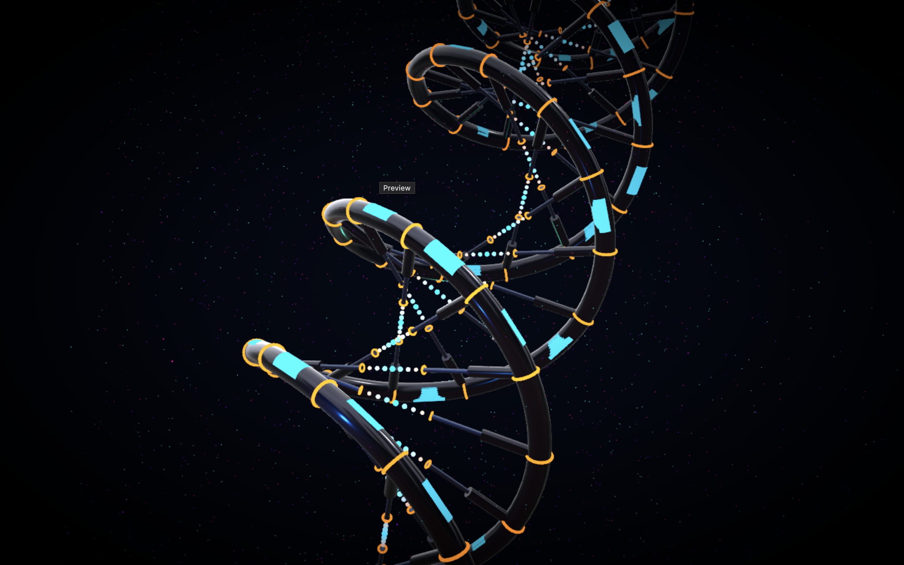

# Cybernetic DNA Visualization

A high-performance, cinematic 3D DNA double helix visualization built with React and Three.js. This project renders a beautifully stylized, mechanical "cybernetic" DNA structure complete with glowing UI tech lines, metallic T-Junction rungs, and bridging energy dots floating within a deep sci-fi void.



## ✨ Features

*   **Cybernetic Aesthetics:** Replaces the standard biological double helix with an intricate, segmented mechanical backbone featuring gunmetal surfaces, glossy reflections, and glowing energy joints.
*   **Energy Bridges:** The base pairs feature a distinctive design with inner floating rings connected by a bridge of scaling, interpolated glowing particles transitioning from neon orange to bright cyan.
*   **Mathematical Smoothness:** Utilizing `CatmullRomCurve3`, the mechanical elements are extrapolated directly onto perfectly smooth splines, allowing for completely fluid twists without jagged geometry.
*   **Cinematic Post-Processing:** Uses advanced WebGL screen-space effects including Bloom (for the intense neon glows), Depth of Field (for macro-lens realism), Chromatic Aberration, and slight Vignetting.
*   **Optimized for 120 FPS:** Built for maximum performance using `<Instances>` to render thousands of meshes in a single draw call. Implements `@react-three/drei`'s `PerformanceMonitor` to automatically scale pixel density based on the user's GPU capabilities.

## 🛠️ Technology Stack

*   **[React 19](https://react.dev/) / [Vite](https://vitejs.dev/):** Core UI framework and lightning-fast build tooling.
*   **[Three.js](https://threejs.org/):** The industry-standard 3D WebGL engine handling mathematical curves, vectors, and rendering.
*   **[React Three Fiber (R3F)](https://docs.pmnd.rs/react-three-fiber):** A powerful React renderer for Three.js, allowing the scene to be built using declarative components and hooks.
*   **[React Three Drei](https://github.com/pmndrs/drei):** Ecosystem helpers for cameras (`OrbitControls`), lighting (`Environment`), and GPU lifecycle management (`PerformanceMonitor`).
*   **[React Three Postprocessing](https://github.com/pmndrs/react-postprocessing):** An effects composer for implementing the cinematic visual overlays.
*   **[Tailwind CSS (v4)](https://tailwindcss.com/):** Used for layout styling of the canvas container structure.

## 🚀 Getting Started

### Prerequisites

Ensure you have [Node.js](https://nodejs.org/) installed on your machine.

### Installation

1. Clone the repository:
   ```bash
   git clone <repository-url>
   cd <project-directory>
   ```

2. Install dependencies:
   ```bash
   npm install
   ```

3. Start the development server:
   ```bash
   npm run dev
   ```

4. Open your browser to `http://localhost:3000` (or the port provided by Vite).

## 🎮 Controls

*   **Left Click + Drag**: Rotate around the DNA structure.
*   **Scroll Wheel**: Zoom in and out.
*   *(Note: Auto-rotation is enabled by default to showcase the cinematic lighting)*
